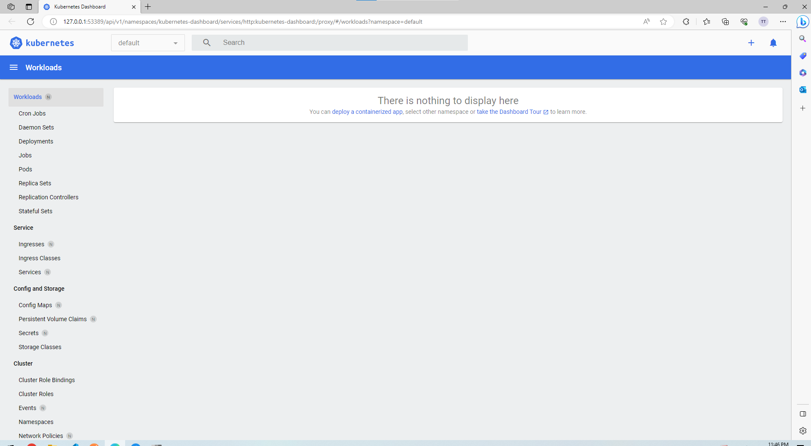

1 Start your cluster start run with administrator on windows
minikube start

ấn lệnh này là để list hết pod đang chạy trong tất cả các namespace cái này check kubectl nhé
kubectl get po -A

ấn lệnh này cx tương tự nhưng mà là inside minikube
minikube kubectl -- get po -A

lệnh này alias thôi
alias kt="minikube kubectl --"

lệnh này nó cho xem cái dashboard nhìn được nhiều thứ hơn
minikube dashboard

