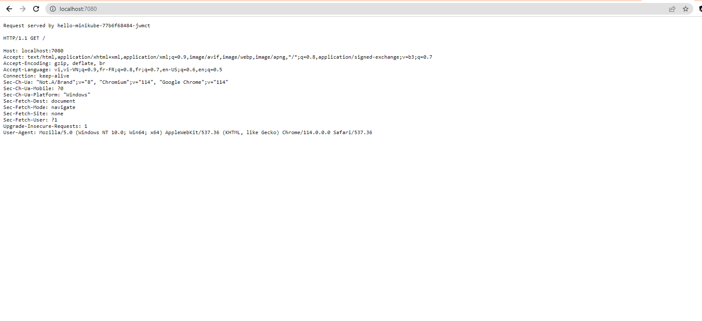
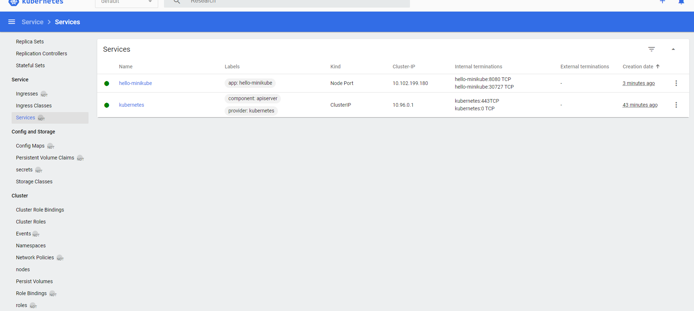
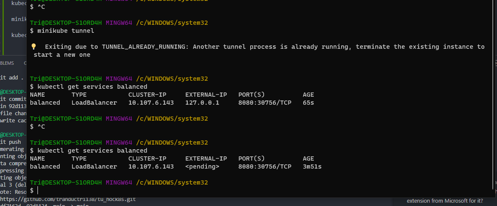

# Start your cluster start run with administrator on windows
minikube start

# ấn lệnh này là để list hết pod đang chạy trong tất cả các namespace cái này check kubectl nhé
kubectl get po -A

# ấn lệnh này cx tương tự nhưng mà là inside minikube
minikube kubectl -- get po -A

# lệnh này alias thôi
alias kt="minikube kubectl --"

# lệnh này nó cho xem cái dashboard nhìn được nhiều thứ hơn
minikube dashboard

# Câu này để tạo một ví dụ deployment expose ở cổng 8080 nhé
kubectl create deployment hello-minikube --image=kicbase/echo-server:1.0
kubectl expose deployment hello-minikube --type=NodePort --port=8080

kubectl get services hello-minikube

# ấn xong lệnh này được hình này nè câu này các yêu cầu gửi đến cổng 7080 nó gửi đến thằng 8080 trên thằng service kia thui 
kubectl port-forward service/hello-minikube 7080:8080

# check service ở đây nhé

# thằng này là thằng loadbalancer nhé , thằng này để làm cân bằng tải thôi sau khi tạo ra dc cái ảnh kia nhé
kubectl create deployment balanced --image=kicbase/echo-server:1.0
kubectl expose deployment balanced --type=LoadBalancer --port=8080

minikube tunnel

kubectl get services balanced

#

